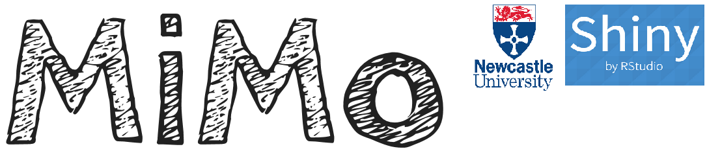

```{r setup, include=FALSE}
knitr::opts_chunk$set(echo = TRUE)
```



# Welcome to the MiMo language analysis tool!

## What is MiMo?

The name MiMo stands for "Minimal Input, Maximal Output".

**Minimal Input**

MiMo allows you to enter text **quickly** and **efficiently** without needing to learn special conventions.

**Maximal Output**

MiMo provides a **rich output**, automatically identifying complex sentences, and colouring in words according to their word class so you can 'see' the structure of sentences.

## Other reasons for using MiMo

1. It is **cross platform**. Because it runs as a web app you can use it on Mac, PC and Linux, and even on mobile phones and tablets (Android and Apple iOS)

2. It works in **over 60 different languages**. So if a child speaks Ancient Coptic, you know where to turn!

3. It is completely **open source** so anyone with sufficient technical knowledge can adapt it to their own ends.

4. It provides **up-to-date norms** from the **Childes** database

## Viewing these help pages

If you wish to see a version of these help pages with a *handy navigation menu*, please click [here](Rmarkdown_instructions.html). You may also wish to download a [Word](Rmarkdown_instructions.docx) and [pdf](Rmarkdown_instructions.pdf) version of these help pages.

## Brief Acknowledgements

MiMO couldn't have been writting without the R programming language, and the R Shiny Apps framework. See the end of the document for further acknowledgements.

# Basic Usage

## Entering data

1. Select `Let's get started!` (at the top of the page) > `(1) Enter text`

2. Click the Radio Button `Enter text in textbox`, and enter your text-to-be-analysed in the text box. Here is some text for you to copy and paste into the text box.

<blockquote>
Tardigrades, also known colloquially as water bears, or moss piglets, are a phylum of water-dwelling, eight-legged, segmented micro-animals. They were first described by the German zoologist Johann August Ephraim Goeze in 1773, who gave them the name of "little water bears". The name Tardigrada, meaning "slow steppers", was given three years later by the Italian biologist Lazzaro Spallanzani.
</blockquote>

3. Then select `Let's get started!` (at the top of the page) > `(2) Check language`

4. If the language detected is correct (it *will* be correct if you enter the above text), proceed to `Let's explore!` > `(2) Coloured output`

5. You should see a colourful table with word classes shaded according to their colour.

### Exploring the coloured output

You can do a lot of cool things with the table.

### --Mouse hovering--

If you hover the mouse over a word, you will see a "tooltip" showing the grammatical category of that word

### --Filtering--

If you enter text in one of the boxes at the top, you can select (or "filter") particular lines

For example, if you type `.rel` in the Search bar it will find all sentences containing relative clauses, or if you type `copula` it will find sentences containing the copula (verb "to be" when used as the MAIN VERB)

### --Sorting--

You can also sort lines

For example, if you scroll to the right and press `num_clause` you can sort the lines so that they are ranked in terms of the number of clauses they contain.

## Identifying speakers

The above text on Tardigrades does not specify a speaker. Note that in the speaker column the "speaker" is specifed as `xxx:`, i.e. some unknown individual.

If you wish to specify speakers, merely type a word at the beginning of an utterance which ends in a colon, e.g. `Jack: CHI: Mum: babysitter:`. Once you have specified a speaker then all the following lines are assumed to belong to that speaker *unless another speaker is specified*.

Try entering the following conversation, in the text box, and then check the language.

<blockquote>
CHI: Gimme that!
ADULT: Can you say "Please"?
CHI: Gimme please!
ADULT: That's right.
Here you go.
What do you think that is?
</blockquote>

You will notice that the language detection doesn't quite work. This is because the algorithm prioritises speed over accuracy. To set the right language, click on the radio button `Select another language` and then enter the name of the language ("English") in the box (make sure you spell it correctly or the app will crash).

Now have a look at the coloured output. You will see that the speakers have been added to the Speaker column.

## Delimiting utterances

The following characters are utterance-final delimiters:

1. One or more periods (full stops) in a row
2. One or more question marks in a row
3. One or more exclamation marks in a row
4. A return (new line) character

# Intermediate use

## Uploading documents

You will note that the app gives you the opportunity to upload a document. You can upload a Microsoft Word format document (with the extension .doc, or docx) or a plain text file. Unfortunately R cannot recognise other formats (e.g. .odt)

## Language metrics

This section is UNDER CONSTRUCTION. To get an idea of what is planned go to `Let's explore!` > `(2) Syntactic measures`. You will see a report of Mean Length of Utterances (in words), and Mean Number of Clauses per Utterance for each speaker.

If you select the `Collection` drop down you can choose a corpus from the CHILDES database to investigate. A graph will appear showing the CHILDES data, with a line of best fit. You can change the age range use the sliders on the left.

The plan is that the user can specify the child's age (see Calendar widgets on the left), and that child will be plotted as a data point on the graph.

# Road Map

The app is still in its early stages. The final version of the app wil be able to do the following

1. Calculate important metrics (Mean Length of Utterance (MLU) in words and morphemes, lexical diversity (VOC-D), an mean number of clauses per utterance)

2. Compare those metrics to a large normative database derived from the CHILDES corpus.

3. Show developmental norms in an interactive graph, so you can see where an individual lies in relation to their age group.

4. Allow you to make comments (which are not analysed for word class), and create your own custom-made tags for conducting your own analyses on things which interest you.

5. Analyse conversational interaction.

6. Print off a report of all the metrics.